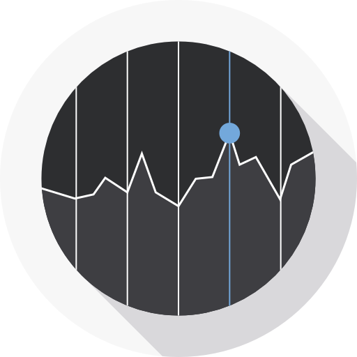

# ETF-Prediction 


> This repository is for  Exchange Traded Funds (ETF) prediction. Tbrain Competion is hold by Trend Micro corp.


## Getting Started
These instructions will get you a copy of the project up and running on your local machine for development and testing purposes. 

* [Prerequisites](#prerequisites)
* [Usage](#usage)


## Prerequisites

### Python Requirements
The python version is Python 2.7.
The required library is listed below .
```bash
pandas==0.22.0
matplotlib==2.2.2
numpy==1.14.3
Keras==2.1.6
scikit_learn==0.19.1
```
(Recommend) Automatically Install by one command .
```bash
$ pip install -r requirements.txt
```


### Download
**For Training**
```bash
$ bash download.sh
```

**Full Version**

Please download the dataset from the competition website.

[[Tbrain-Competion] - ETF Prediction](https://tbrain.trendmicro.com.tw/Competitions/Details/2)


## Usage
### Run the prediction script
```bash
$ python prediction.py
```


## Authors

| [<br /><sub><b>Chung Kai Hsieh</b></sub>](https://github.com/account)<br />        | [<br /><sub><b>Po Kai Zeng</b></sub>](https://www.facebook.com/profile.php?id=100002447178685)<br />  | [<br /><sub><b>Shane Lin</b></sub>](https://www.facebook.com/yuhsiang.lin.79)<br /> |
|:---:|:---:|:---:|


## Acknowledgement
<div>Icons made by <a href="http://www.freepik.com" title="Freepik">Freepik</a> from <a href="https://www.flaticon.com/" title="Flaticon">www.flaticon.com</a> is licensed by <a href="http://creativecommons.org/licenses/by/3.0/" title="Creative Commons BY 3.0" target="_blank">CC 3.0 BY</a></div>


